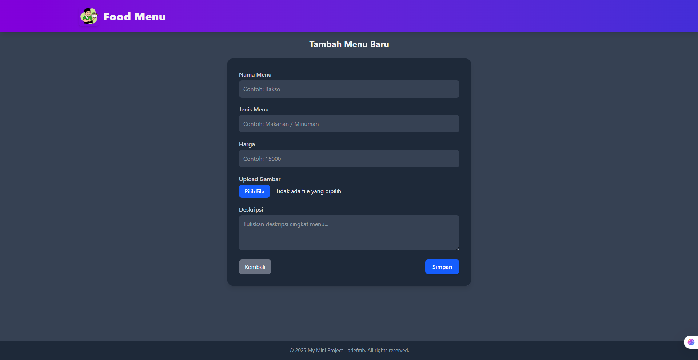

# <div style="display:flex; align-items:center; justify-content:center; gap:10px;">Food Menu System (Laravel)</div>

   

## ✨ Features
- 📋 Manage Food Menus (Create, Read, Update, Delete)  
- 🖼️ Upload & Display Food Images (stored in `storage/app/public`)  
- 💰 Manage Menu Price & Description  
- 📱 Responsive UI with TailwindCSS
- 🌐 Provides Public API

## 🛠️ Tech Stack
- **Framework**: Laravel 10  
- **Frontend**: TailwindCSS  
- **Database**: MySQL  
- **Bundler**: Vite  

## 🚀 Installation
1. Clone this repository:

```bash
  git clone https://github.com/ariefmb/food-menu-system-laravel.git
  cd food-menu-system-laravel
```
2. Install PHP dependencies:

```bash
  composer Install
```
3. Install Node.js dependencies

```bash
  npm install
```
4. Configure your database in `.env`, then run migration:

```bash
  php artisan migrate
```
5. Link storage for images:

```bash
  php artisan storage:link
```
6. Start development server:

```bash
  php artisan serve
  npm run dev
```

## Screenshots
<div style="display:flex; align-items:center; justify-content:center; gap:10px;">



</div>

## Authors
- Developed by [ariefmb](https://www.github.com/ariefmb)🚀

## License
The Laravel framework is open-sourced software licensed under the [MIT License](https://opensource.org/license/MIT)
